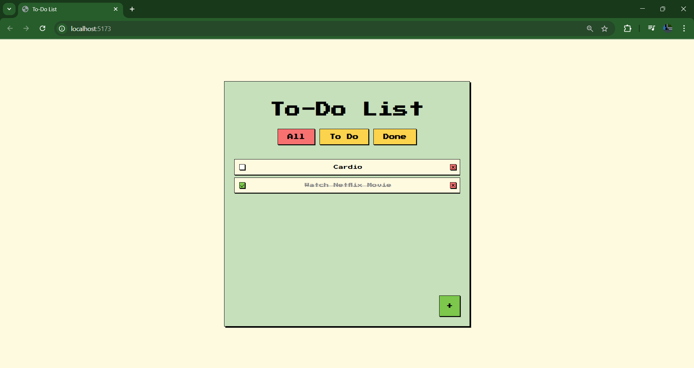

# 🚀 **To-Do List Application**

### Aplikasi To-Do List dengan VueJS dan ViteJS

Aplikasi **To-Do List** ini dibangun menggunakan **VueJS** dan **ViteJS** untuk mengelola kegiatan sehari-hari. Aplikasi ini menawarkan fitur-fitur interaktif untuk menambahkan, menghapus, dan menandai kegiatan yang telah selesai. Tampilannya yang menarik dan simple membuatnya mudah digunakan dan menyenangkan.

---

## 📝 **Fitur Utama**

- **Melihat Daftar Kegiatan**  
  Menampilkan semua kegiatan yang telah ditambahkan.

- **Menambahkan Kegiatan Baru**  
  Pengguna dapat menambahkan kegiatan baru dengan mudah.

- **Membatalkan Kegiatan**  
  Pengguna dapat menghapus kegiatan yang tidak diinginkan.

- **Menandai Kegiatan yang Selesai**  
  Ceklis kegiatan yang sudah selesai, dengan tanda visual berupa teks yang dicoret.

- **Memfilter Kegiatan**  
  Tampilkan hanya kegiatan yang belum selesai, atau semua kegiatan yang telah selesai.

- **Tampilan Menarik**  
  Dilengkapi dengan **CSS** menarik menggunakan **Pixel Art**, **Dark Mode**, dan **Glassmorphism**.

---

## 🎨 **Tampilan Aplikasi**



---

## ⚙️ **Teknologi yang Digunakan**

- **VueJS**: Framework JavaScript untuk membangun antarmuka dinamis.
- **ViteJS**: Build tool yang cepat untuk pengembangan aplikasi Vue.
- **CSS**: Styling aplikasi. 

---

## 🏃‍♂️ **Cara Penggunaan**

1. **Menambahkan Kegiatan**  
   Klik tombol **+** di pojok kanan bawah untuk menambahkan kegiatan baru.  
   Masukkan kegiatan di kolom input, kemudian klik **Add** untuk menambahkannya ke daftar.

2. **Membatalkan Kegiatan**  
   Jika ingin membatalkan penambahan kegiatan, klik tombol **Cancel**.

3. **Menandai Kegiatan Selesai**  
   Ceklis di samping kegiatan yang sudah selesai. Kegiatan yang telah selesai akan dicoret secara visual.

4. **Memfilter Kegiatan**  
   Pilih filter pada navbar untuk menampilkan:
   - **All**: Semua kegiatan.
   - **To Do**: Kegiatan yang belum selesai.
   - **Done**: Kegiatan yang sudah selesai.

5. **Menghapus Kegiatan**  
   Klik tombol **✖** di samping kegiatan untuk menghapusnya dari daftar.

---

## 💻 **Instalasi**

Ikuti langkah-langkah berikut untuk menjalankan aplikasi ini di lingkungan pengembangan lokal:

1. **Clone repositori**:
   ```bash
   git clone https://github.com/iphamm/32-pbk-uts-233510302.git
   cd 32-pbk-uts-233510302
   npm install
   npm run dev
